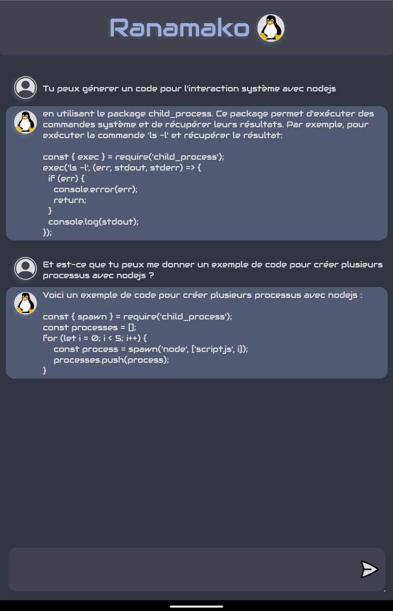
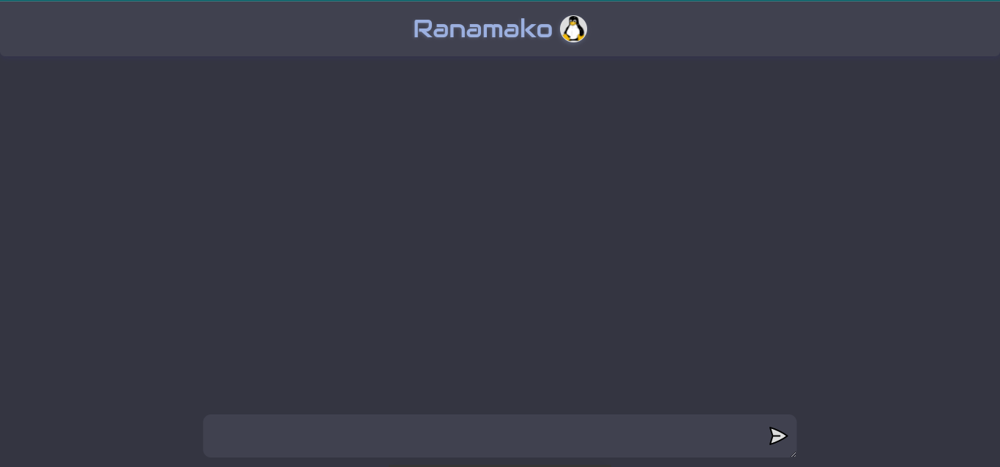

# Ranamako

  

      
  

  
- [ ] <b>Description</b>
  - Ranamako est un bot IA qui utilise l'API de OpenAI
  - Il fonctionne sur le web aussi que mobile
  - Build by [iTeam-$ community](https://iteam-s.mg)
  - and we happy 😊 ...

- [ ] <b>Technologies</b>
  - Angular: pour le developpement frontend (base de codes)
  - Capacitor: pour la création de l'application mobile
  - Nodejs (Express.js): pour créer une api qui appelle OpenAI
 
 [iTeam-$ community](https://github.com/iTeam-S), happy coding 😊 ...
